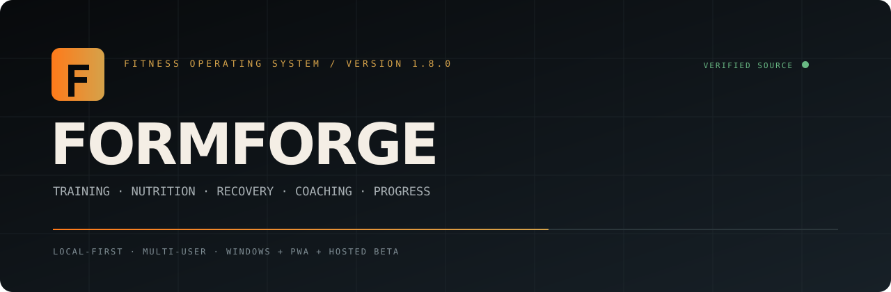

<p align="center"></p>

# FormForge Fitness OS

[](https://github.com/thacanadian/Formforge/actions/workflows/verify.yml)

**Version 1.8.0**  
**Windows:** Windows 10/11 x64 desktop installer and portable build  
**Mobile:** responsive installable PWA for iPhone, iPad, and Android

FormForge is a privacy-focused, local-first, multi-user fitness workspace built from the supplied `formforge.html` and `FitCoach.jsx` prototypes. It combines training, nutrition, progress, recovery, health-data imports, accountability, encrypted backups, mobile access, and an offline/online AI coach in one application. The Windows executable contains its server and web interface, starts the HTTPS backend automatically, opens Microsoft Edge in a dedicated app window, and stores live data outside the installation folder at `%LOCALAPPDATA%\FormForge` so updates and repairs do not erase it.

> **Release status:** v1.8.0 source release. Local builds are self-hosted; the optional hosted beta requires operator configuration before production use. FormForge is not medical advice.

## Major features


### Hosted beta on Render

Version 1.8.0 retains the managed-hosting mode and adds public legal pages, versioned consent, adult eligibility enforcement, account deletion, and store-policy-oriented community moderation. Version 1.7.1 originally added the managed-hosting mode for a small private beta. The included `render.yaml` runs FormForge as a single Go web service behind Render HTTPS, stores all live data under a persistent `/var/data` disk, protects first-administrator creation with a generated setup token, trusts Render proxy headers for per-user login throttling/audit IPs, and can load the optional OpenAI key from Render environment secrets. See `docs/RENDER_DEPLOYMENT.md`.


### Legal, privacy, deletion, and community safety

- Public pages for Terms of Use, Privacy Notice, Community Standards, Subscription Terms, Health and AI Notice, Security/Breach Notice, and account deletion.
- Operator identity, contacts, minimum age, price, and governing-law wording are configured through Render environment variables; the application visibly warns administrators when required production details are missing.
- Hosted setup enforces acceptance of the current Terms and Privacy Notice plus an 18+ age confirmation. Community posting separately requires the current Community Standards.
- Versioned acceptance records support renewed consent when a policy changes.
- In-app account deletion and a public web deletion page remove active account data and photos, with safeguards for the sole administrator and disclosures about store-subscription cancellation and limited legal/security retention.
- Community reports now cover content and user accounts. Users can block others, harmful text is filtered, repeated nudges are rate-limited, reported content is hidden for the reporter, and administrators can dismiss, remove, warn, suspend, or ban with audit records.
- Review copies and operator checklists are in `docs/legal/`, `docs/LEGAL_LAUNCH_CHECKLIST.md`, `docs/COMMUNITY_MODERATION_OPERATIONS.md`, and `docs/APP_STORE_COMPLIANCE.md`.

### Accounts, security, and data integrity

- Administrator and standard-user accounts with role-based permissions.
- PBKDF2-HMAC-SHA-256 password hashing, secure HTTP-only cookies, strict same-site cookies, CSRF protection, login throttling, and temporary account lockouts.
- Optional RFC 6238 TOTP authenticator protection for administrator accounts, plus one-time recovery codes.
- Per-device/session list showing device label, IP address, creation time, last activity, expiration, and manual session revocation.
- Administrator recovery using the exported installation recovery key.
- Schema-versioned database migrations that run during startup and restore, record migration history, and create a pre-migration safety copy.
- Health endpoint reporting `up`, `degraded`, or `down` based on database access, schema state, backup age, data-folder access, and failed background jobs.
- Structured local JSON event logging, client error capture, server panic logging, and optional HTTPS crash reporting controlled by the administrator.
- Password-protected JSON and CSV exports using PBKDF2 and AES-GCM, with integrity validation and protected JSON re-import.
- Automatic encrypted backups, manual backups, rotation, integrity checks, optional OneDrive/selected-folder copies, recovery-key export, and restore. Encrypted backups include progress-photo files as well as the database.

### Appearance, measurements, and member interface

- FormForge 1.7 introduces a calmer retro-terminal shell with a focused four-card command center, restrained amber accents, generous spacing, and responsive desktop/mobile layouts.
- A dedicated **Appearance** page is available from **More → Appearance + Units**.
- Five visual presets—**Forge, Midnight, Iron, Arctic, and Forest**—plus custom accent, background, surface, text, corner-radius, and comfortable/compact density controls.
- Per-user **Imperial** or **Metric** measurements. FormForge stores canonical weight and height in kilograms and centimeters, then converts inputs and displays to pounds/inches or kilograms/centimeters without corrupting historical data.
- Standard users receive a focused navigation by default: Dashboard, AI Coach, Workouts, Nutrition, Progress, and More. On phones, the bottom navigation keeps the five most-used destinations.
- **More** preserves every authorized feature, including Coaching Team, Agent, Health + Recovery, Habits, Community, Check-In, Marketplace, Mobile setup, Appearance, Security, Profile/Data, and administrator tools.
- Administrators can use **Preview member view** from More to inspect the simplified non-admin experience without changing accounts or permissions. Users may still select focused or full navigation in Appearance.
- Scroll reveals, page transitions, hover depth, and progress feedback add motion without interfering with use; all nonessential motion is disabled when the device requests reduced motion.

### Coaching Team and creator imports

Each user can select up to five influences, assign blend weights, choose a response style, and choose a preferred tiebreaker coach when selected philosophies disagree. The expanded editorial catalog includes Jeff Nippard, Noel Deyzel, Ronnie Coleman, Arnold Schwarzenegger, Mike Israetel, Sam Sulek, David Goggins, Layne Norton, Eric Helms, Jeff Cavaliere, Jeremy Ethier, Chris Bumstead, Jay Cutler, Dorian Yates, Tom Platz, Ben Patrick, MegSquats, Sohee Lee, Greg Doucette, Will Tennyson, Hybrid Calisthenics, Alan Thrall, Bret Contreras, and FormForge Balanced.

Administrators can add a creator who is not built in by pasting a public YouTube, TikTok, Instagram, Spotify, Apple Podcasts, Threads, X, Facebook, newsletter, or website URL. FormForge rejects localhost/private-network URLs, recognizes the platform, retrieves limited public oEmbed or page metadata where permitted, checks duplicates, and requires the administrator to write an original summary, principles, and communication traits before publishing the profile. Public links are references only; FormForge does not automatically download complete channels, paid programs, videos, articles, private content, or entire transcripts.

Profiles remain **Editorial** unless the operator documents authorization and marks them **Official**. FormForge never claims that it is the creator, clones an exact voice, or implies endorsement. The Approved Source Library supports original source summaries, short permitted excerpts, licensed material, research, and exact quotations that an administrator has manually verified. AI responses display either **Grounded in [source]** tags or a **General fitness knowledge** tag. A public creator takedown form and administrator review queue support correction or removal requests.

### AI Coach, autonomous agent, and knowledge vault

- The original offline, online-compatible, and Auto AI Coach behaviors remain available, including workouts, progression, nutrition, recovery, injury-aware substitutions, Coaching Team blends, health context, memory, history, source grounding, and phone-offline coaching.
- **FormForge Agent** runs inside the FormForge server and does not redirect users to ChatGPT. It can use a local OpenAI-compatible model server such as Ollama or llama.cpp, a self-hosted search endpoint, bounded public-page fetching, local memories, task history, tool auditing, and administrator-reviewed creator research.
- The bundled **Forge Knowledge Vault** contains 60 original expert reference modules across hypertrophy, strength, programming, technique, nutrition, supplements, recovery, pain and injury, cardio, body composition, special populations, athletic performance, mobility, training styles, behavior, evidence literacy, and safety. Retrieval combines those modules with each user’s records, approved creator sources, verified quotations, and optional current web research.
- When a user asks for sources or links, online/agent mode can return the real URLs used. Exact quotations are only returned from administrator-verified quotation records or text visibly present in the supplied source; otherwise FormForge paraphrases and states that no verified quote is available. It never invents a citation or quote.
- FormForge is intentionally broad and evidence-aware, not literally omniscient or a replacement for a physician, dietitian, or other licensed professional.

- Offline server coach using the user’s profile, equipment, goals, logs, check-ins, pain flags, Coaching Team blend, preferred tiebreaker, and approved local source summaries.
- Phone-offline coach pack cached in the installed PWA.
- Online mode using an administrator-configured OpenAI-compatible Chat Completions provider.
- Auto mode that tries online AI and falls back to the offline coach when the provider, internet, budget, or plan is unavailable.
- Separate chat history per user, full-history clearing, and individual-message deletion.
- Grounding labels on responses, verified-quote safeguards, and safety responses for severe symptoms or injury questions.
- Daily per-user token and estimated-cost accounting with administrator-defined caps.
- **Free tier:** unlimited local tools and offline coaching; online AI disabled unless the administrator intentionally gives the free tier a small allowance.
- **Pro tier:** online AI access within administrator-set token and cost caps. Administrators can assign tiers; the local build does not collect payments or include a payment processor.
- API keys are encrypted by the backend and are never returned to browser JavaScript or included in clean distributions.

### Training and recovery

- Personalized onboarding, goals, body measurements, experience level, equipment, and calorie/macro calculations.
- Beginner, intermediate, and advanced workout libraries, custom workouts, weekly scheduling, exercise explanations, active workout logging, and workout history.
- Performance logging for each exercise: working weight, reps, sets, completion, and RPE.
- Progressive-overload recommendations based on recent load, reps, completion, and RPE, including when to add weight, repeat a load, or reduce it.
- Pain/injury flags by body area, severity, movement trigger, and notes. Workout generation uses pain-aware substitutions while clearly stating that FormForge does not diagnose injuries.
- Weekly check-ins for adherence, availability, fatigue, energy, and recovery-week adjustments.
- Encrypted local progress photos with date and caption. Photos are never uploaded by FormForge and are included in encrypted backups.

### Nutrition and health data

- Daily calorie, protein, carbohydrate, and fat tracking with editable targets.
- Built-in food search, manual foods, online public food lookup, barcode entry, and camera barcode scanning where supported.
- Forward-looking 1–14 day meal-plan generator using the saved targets and simple preferences such as vegetarian eating.
- Weight and body-fat progress logs, history, and charts.
- File-import health connectors for Apple Health XML, Google Fit/Health Connect JSON or CSV, Garmin exports, WHOOP exports, Oura exports, and generic HR-strap CSV sessions.
- Web Bluetooth heart-rate strap capture on compatible mobile/desktop browsers.
- Health metrics and connection history remain in the local FormForge database. Direct vendor OAuth synchronization requires separate vendor developer approval and credentials and is not embedded in the clean distribution.

### Household accountability

- Shared household leaderboard comparing weekly workouts, habit completions, and streaks.
- In-app encouragement/nudges between authorized users.
- Shared workout scheduling with multiple approved participants.
- Separate accounts and private personal logs; only the intended household summary and shared items are exposed through the social page.

### Mobile and networking

The Windows server binds to loopback only by default. Administrators can enable private-LAN access, install a private-network Windows Firewall rule, download the local FormForge certificate authority, and approve separate mobile users. The PWA can be installed from the private HTTPS address and remains usable as a phone-only offline coach when the PC is unreachable. Shared logs and collaboration require the Windows PC to remain running FormForge. Remote access requires a private VPN or separately managed hosting; do not forward the FormForge port directly to the public internet.

### Maintenance and updates

- Background job records for automatic encrypted backups and backup-integrity checks.
- Signed update channel support using an HTTPS manifest, Ed25519 signature verification, and installer SHA-256 verification before staging.
- `tools/update-signer` creates signing keys and signed manifests. The private signing key is never bundled.
- Updates replace application files only and preserve `%LOCALAPPDATA%\FormForge`.
- Repair launcher and `formforge://start` recovery protocol for stale browser/PWA shortcuts or local-server startup failures.

## Install or update

1. Close all FormForge windows.
2. Run `FormForge-Setup-1.8.0.exe` as the normal Windows user.
3. Launch from the FormForge Desktop or Start Menu shortcut, not an old browser-installed localhost shortcut.
4. Open **More → Appearance + Units** to choose a preset, custom colors, Imperial or Metric measurements, and focused or full navigation.
5. Administrators can use **Preview member view** in the top bar to inspect the non-admin interface.
6. Open **Security** to configure TOTP, review sessions, accept the current terms, and review AI usage.
7. Open **Coaching Team** to select influences or link a custom creator.
8. Open **AI Agent** to configure the local model/search runtime and inspect the Forge Knowledge Vault.
9. Open **Health + Plans** for health imports, pain flags, overload recommendations, meal plans, and encrypted photos.

## Portable version

Extract the portable ZIP and run `FormForge.exe`. It does not require separately installed Python, Node.js, Java, Chrome, or developer tools. Microsoft Edge is used in dedicated app mode; this is a dedicated browser application window rather than an Electron or embedded-WebView2 executable.

## Data folder

```text
%LOCALAPPDATA%\FormForge\
  formforge.db.json
  formforge.db.json.prev
  master.key
  certs\
  backups\
  migration-backups\
  photos\
  logs\events.jsonl
  updates\
```

## Build from source

Developers need Go 1.22 or newer. Node is optional for JavaScript syntax validation. Chromium is optional for the browser runtime smoke test.

```powershell
.\scripts\build-windows.ps1
```

or:

```bash
./scripts/build-all.sh
```

For signed updates:

```bash
go run ./tools/update-signer -generate-key
go run ./tools/update-signer -version 1.8.0 -url https://updates.example.com/FormForge-Setup-1.8.0.exe -file dist/Setup.exe -private-key update-private.key -out update-manifest.json
```

Read `docs/RENDER_DEPLOYMENT.md`, `docs/APPEARANCE_AND_UNITS.md`, `docs/MEMBER_INTERFACE.md`, `docs/AGENT_RUNTIME.md`, `docs/SECURITY.md`, `docs/BACKUP_RECOVERY.md`, `docs/CREATOR_TAKEDOWN.md`, `docs/WEARABLES.md`, `docs/TERMS_AND_CREATOR_RIGHTS.md`, and `docs/TEST_REPORT.md` before wider distribution.
