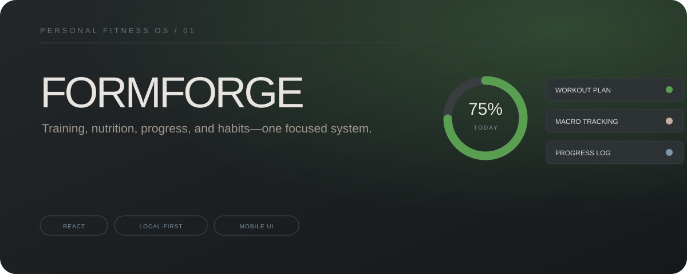

<p align="center">
  
</p>

# FormForge

FormForge is a mobile-first personal fitness dashboard for planning workouts, tracking nutrition, monitoring progress, and building consistent habits. I built it as an experiment in turning scattered fitness tools into one calm, focused daily system.

## What it does

- Personalized onboarding for goals, experience, and equipment
- Workout planning and exercise tracking
- Daily calories and macro tracking
- Barcode-scanner flow with manual fallback
- Weight, measurement, and progress logging
- Habit and streak tracking
- Local-first browser storage
- Responsive mobile interface

## Stack

`React` · `Vite` · `JavaScript` · `LocalStorage` · `MediaDevices API`

## Run locally

```bash
git clone https://github.com/thacanadian/Formforge.git
cd Formforge
npm install
npm run dev
```

Open the local URL shown by Vite.

## Production build

```bash
npm run build
npm run preview
```

## Project status

FormForge is an active product experiment, not a medical or nutrition service. Core local tracking works in the browser. The experimental AI-generation path should be connected to a secure server-side proxy before public deployment; API credentials should never be placed in client code.

## Roadmap

- Break the prototype into smaller tested components
- Add import/export for user-owned data
- Add installable PWA support
- Improve accessibility and keyboard navigation
- Add a secure AI proxy and clearer offline behavior

## Privacy

Fitness data is stored locally in the current browser. Clearing browser storage or using the in-app reset removes that local data.

## Author

Built by [Noah Krynicki](https://www.linkedin.com/in/noah-krynicki-48513b312/) — [GitHub](https://github.com/thacanadian) · [Portfolio](https://noah-krynicki-portfolio.noahwkry.chatgpt.site)
